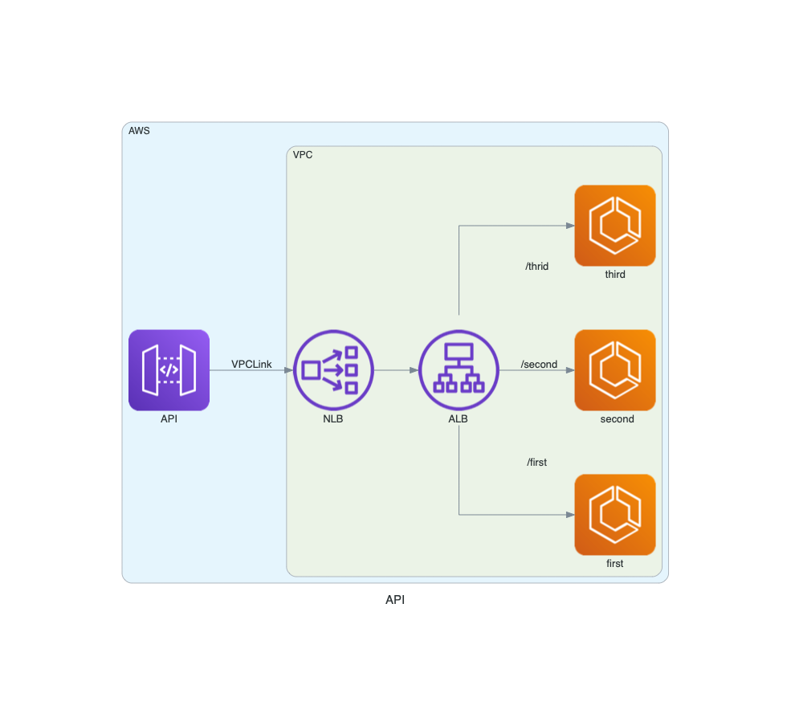

# API Gateway Rest API to ECS fronted by an Application Load Balancer 

## Design

## Deploy
If you specify a vpcid, it will be used. Otherwise, a VPC will be created as part of the stack. 

Complete Stack
~~~
cdk deploy -c vpcid=vpc-######### -c account=######## -c region=us-east-2 ApigwEcsStack
~~~

Add additional ECS service, ALB Target Group, attach the service to target group, and attache the target group to the ALB Listener
~~~
cdk deploy -c vpcid=vpc-######### -c ###alb-arn###  alb=-c account=######## -c region=us-east-2 EcsStack
~~~